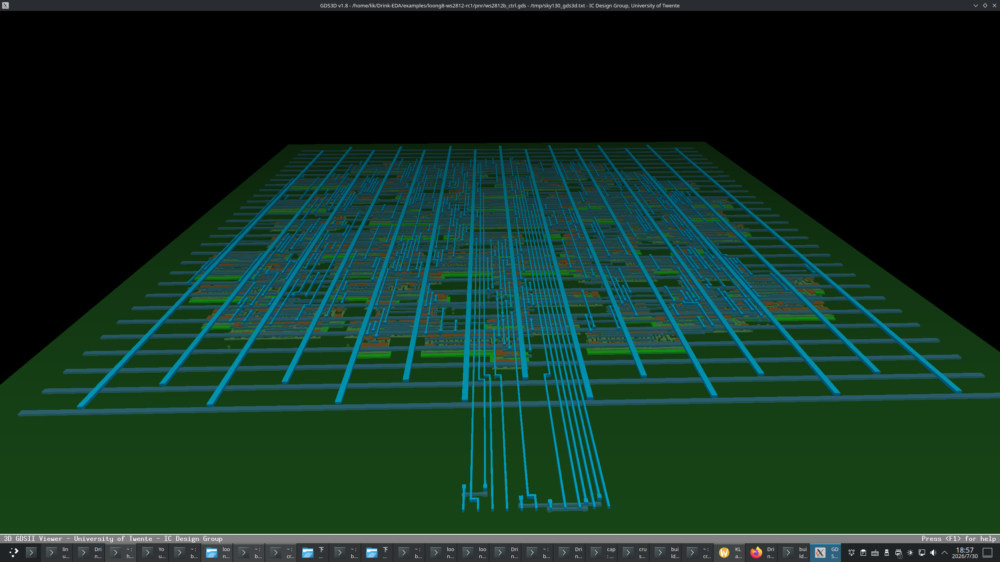
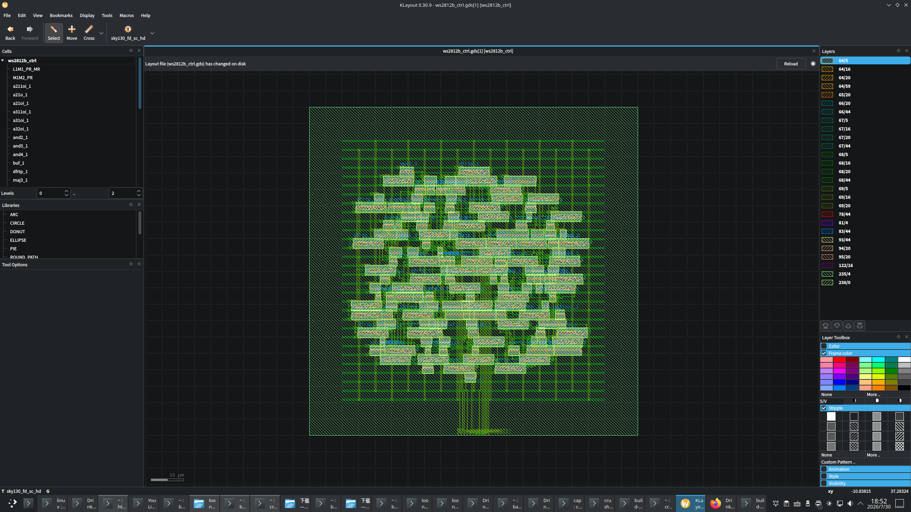
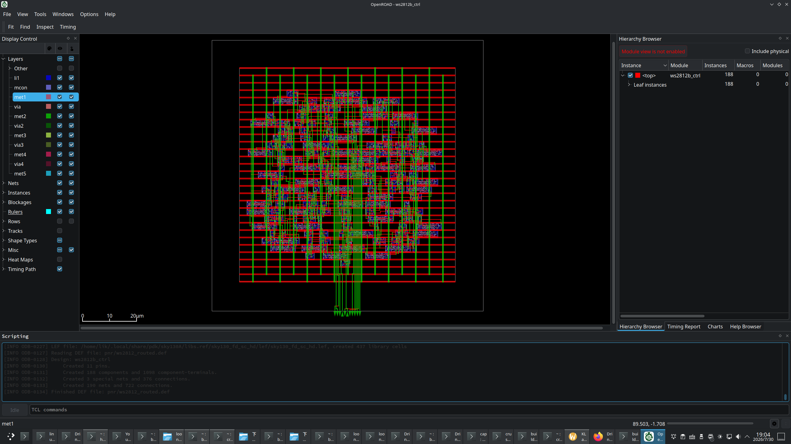

# loong8-ws2812-rc2

WS2812B 智能 LED 控制器硬核实现 —— loong8 体系结构的专用硬件衍生

## 概述

不可编程的 WS2812B 彩灯控制器，内建紫色呼吸灯效果。纯硬件状态机替代"CPU+固件"方案，188 个标准单元，0 DRC 违例。

## 设计规格

| 项目 | 参数 |
|------|------|
| 功能 | WS2812B 呼吸灯驱动（紫色渐变） |
| 工艺 | SkyWater sky130A (130nm) |
| 时钟 | 50MHz → 800KHz WS2812B 时序 |
| 面积 | 100 × 100 μm |
| 标准单元 | 188 （50 DFF + 138 组合） |
| 验证 | 0 DRC 违例，三角时序收敛 ✅ |
| Setup Slack (TT) | **17.398 ns** |
| Setup Slack (SS) | **16.779 ns** |
| Hold Slack (FF)  | **0.329 ns** |
| 全流程 | ~70 秒 |

## 快速开始

```bash
cd /home/lik/Drink-EDA/examples/loong8-ws2812-rc2
./build.sh          # 一键全流程
./build.sh gds      # 仅 GDS（strm2gds 零 Python）
./build.sh clean    # 清理
```

## 目录

```
loong8-ws2812-rc2/
├── build.sh              # 一键构建（自动检测工具链）
├── Makefile              # make 快捷入口
├── README.md             # 本文件
├── EXPERIENCE.md         # 开发经验总结
├── rtl/
│   └── ws2812_led.v      # RTL 源码
├── scripts/
│   ├── pnr_flow.tcl      # OpenROAD PnR 脚本
│   └── def2gds.sh        # DEF→GDS 转换
├── synth/
│   ├── ws2812_synth.v    # 综合输出
│   └── ws2812_pnr.v      # 映射后网表
├── pnr/
│   ├── ws2812_routed.def # 布线后版图（0 DRC）
│   ├── ws2812b_ctrl.gds  # 完整 GDS（324K，含晶体管）
│   └── ws2812_drc.rpt    # DRC 报告（空 = 0 违例）
├── log/
│   ├── synth.log         # 综合日志
│   └── route.log         # 布线日志
└── sim/
    ├── ws2812b_tb.v      # 测试平台
    ├── ws2812b_tb2.v
    └── check_sim.v       # 仿真检查
```

## 工具链

| 工具 | 用途 | 依赖 |
|------|------|------|
| Yosys 0.67+ | 逻辑综合 | 需 LoongArch ABC SCL hash 补丁 |
| OpenROAD 26Q3 | 布局布线 | 禁用 GPL 模块 |
| **strm2gds** (内嵌) | DEF→GDS 转换（后缀匹配） | 零 Python，零插件依赖 |
| strm2gds (KLayout) | LEF 抽象 GDS（无晶体管） | 无额外依赖 |
| map_synth | ABC 网表 → PnR 网表重命名 | 无 |
| sky130 PDK | SkyWater 130nm 工艺库 | open_pdks 安装 |

**GDS 生成说明**：`pnr/ws2812b_ctrl.gds` 为预生成文件，含完整晶体管几何。
调用 `strm2gds` 重新生成（零 Python）。

## 布线收敛

```
迭代 0:  370 → 迭代 4:  0 violations  ✅
线长: 12,449 μm  通孔: 1,804  runtime: 68s
```

## 查看版图

```bash
klayout pnr/ws2812b_ctrl.gds &
```


*GDS3D 3D 立体渲染（295,692 个三角面）*


*GDS 完整版图（含晶体管、金属连线）*


*OpenROAD GUI 布局视图（cell 分布与信号连线）*

## 设计细节

- **呼吸灯**: 1ms 步进，0→255 循环，红蓝同步 → 紫色
- **WS2812B 时序**: Bit0 = 3+13 周期, Bit1 = 9+7 周期 @ 800KHz
- **数据率**: 800 Kbps

## 许可证

Apache License 2.0 — 详见 [LICENSE](../../LICENSE)
